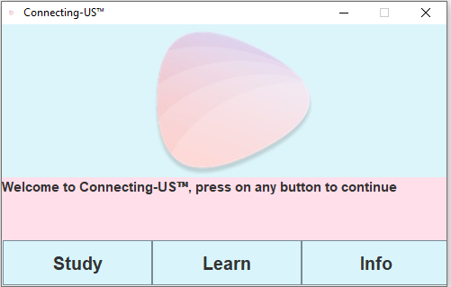

# States-Project

The purpose of this game demo is to help students learn the states and corresponding capitals. 
________________________________________________________________ 

 

Click the study button to go over all the states and learn a little extra 
about them.  

Study-Guide: 
 

After studying and going over all the states, feel free to click the learn 
button to be tested on the capitals of random states! You will be given 
5 states and your score will be out of 5 at the end of the game.  

Test: 

When you are finished, exit out of the game and you're all set! 
To play another game, simply click the learn button again. Enjoy!
